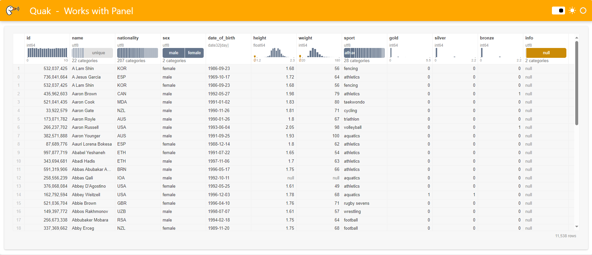

<h1>
<p align="center">
  
  <br>quak /kwæk/
</h1>
  <p align="center">
    <span>an <a href="https://github.com/manzt/anywidget">anywidget</a> for data that talks like a duck</span>
  </p>
</p>

**quak** is a scalable data profiler for quickly scanning large tables,
capturing interactions as executable SQL queries.

- **interactive** 🖱️ mouse over column summaries, cross-filter, sort, and slice rows.
- **fast** ⚡ built with [Mosaic](https://github.com/uwdata/mosaic); views are expressed as SQL queries lazily executed by [DuckDB](https://duckdb.org/).
- **flexible** 🔄 supports many data types and formats via [Apache Arrow](https://arrow.apache.org/docs/index.html) and the [dataframe interchange protocol](https://data-apis.org/dataframe-protocol/latest/purpose_and_scope.html).
- **reproducible** 📓 a UI for building complex SQL queries; materialize views in the kernel for further analysis.

## install

> [!WARNING]
> **quak** is a prototype exploring a high-performance data profiler based on
> anywidget. It is not production-ready. Expect bugs. Open-sourced for SciPy
> 2024.

```sh
pip install quak
```

## usage

The easiest way to get started with **quak** is using the IPython
[cell magic](https://ipython.readthedocs.io/en/stable/interactive/magics.html).

```python
%load_ext quak
```

```python
import polars as pl

df = pl.read_parquet("https://github.com/uwdata/mosaic/raw/main/data/athletes.parquet")
df
```


**quak** hooks into Jupyter's display mechanism to automatically render any
dataframe-like object (implementing the [Python dataframe interchange
protocol](https://data-apis.org/dataframe-protocol/latest/purpose_and_scope.html))
using `quak.Widget` instead of the default display.

Alternatively, you can use `quak.Widget` directly:

```python
import polars as pl
import quak

df = pl.read_parquet("https://github.com/uwdata/mosaic/raw/main/data/athletes.parquet")
widget = quak.Widget(df)
widget
```

### interacting with the data

**quak** captures all user interactions as _queries_.

At any point, table state can be accessed as SQL,

```python
widget.sql # SELECT * FROM df WHERE ...
```

which for convenience can be executed in the kernel to materialize the view for further analysis:

```python
widget.data() # returns duckdb.DuckDBPyRelation object
```

By representing UI state as SQL, **quak** makes it easy to generate complex
queries via interactions that would be challenging to write manually, while
keeping them reproducible.

### using quak in marimo

**quak** can also be used in [**marimo** notebooks](https://github.com/marimo-team/marimo),
which provide out-of-the-box support for anywidget:

```python
import marimo as mo
import polars as pl
import quak

df = pl.read_parquet("https://github.com/uwdata/mosaic/raw/main/data/athletes.parquet")
widget = mo.ui.anywidget(quak.Widget(df))
widget
```

### Using Quak with Panel

**Quak** can also be integrated with [**Panel**](https://panel.holoviz.org/reference/index.html) to create dynamic reports, tools for notebooks, and live data apps. It's a powerful combination for data visualization and interactivity!

First, install the necessary packages:

```bash
pip install quak polars panel ipywidgets_bokeh
```

Now, let's get quacking as usual:

```python
import polars as pl
import quak

QUAK_LOGO = "https://github.com/manzt/quak/raw/main/assets/logo-color.svg"

df = pl.read_parquet("https://github.com/uwdata/mosaic/raw/main/data/athletes.parquet")
quack_widget = quak.Widget(df)
```

Next, integrate Quak with Panel:

```python
import panel as pn

# Add support for anywidget/ ipywidgets
pn.extension("ipywidgets")

# Adjust widget layout
quack_widget.layout.width = quack_widget.layout.height = "100%"

# Create a Panel component
quack_component = pn.pane.IPyWidget(quack_widget, sizing_mode="stretch_both")

# Create and serve the app
pn.template.FastListTemplate(
    logo=QUAK_LOGO,
    site="Quak",
    title="Works with Panel",
    main=[quack_component],
    accent="#FFA700",
).servable()
```

To launch your app, use the following command in a terminal:

```bash
panel serve app.py
```

Your app should now look like this:



## contributing

Contributors welcome! Check the [Contributors Guide](./CONTRIBUTING.md) to get
started. Note: I'm wrapping up my PhD, so I might be slow to respond. Please
open an issue before contributing a new feature.

## references

**quak** pieces together many important ideas from the web and Python data science ecosystems. 
It serves as an example of what you can achieve by embracing these platforms for their strengths.

- [Observable's data table](https://observablehq.com/documentation/cells/data-table): Inspiration for the UI design and user interactions.
- [Mosaic](https://github.com/uwdata/mosaic): The foundation for linking databases and interactive table views. 
- [Apache Arrow](https://arrow.apache.org/): Support for various data types and efficient data interchange between JS/Python.
- [DuckDB](https://duckdb.org/): An amazingly engineered piece of software that makes SQL go vroom.
